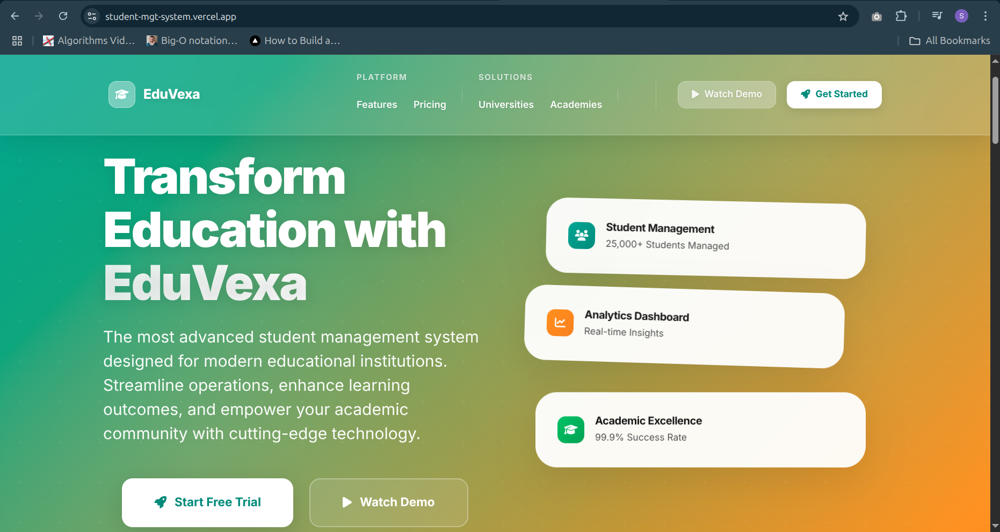

# EduVexa - Student Academic Management System

<div align="center">



**A comprehensive web-based platform for student, course, and skills tracking**

[](https://opensource.org/licenses/MIT)
[](https://nodejs.org/)
[](https://expressjs.com/)
[](https://developer.mozilla.org/en-US/docs/Web/JavaScript)

*Developed by Shittu Rofeeq (IDEAS/24/87636)*  
*Baze University, Abuja - Software Engineering Department*

[Live Demo](https://student-mgt-system.vercel.app/) • [Documentation](#api-documentation) • [Report Bug](https://github.com/rofeeqshittu/student-mgt-system/issues) • [Request Feature](https://github.com/rofeeqshittu/student-mgt-system/issues)

</div>

---

## Table of Contents

- [Overview](#overview)
- [Features](#features)
- [Prerequisites](#prerequisites)
- [Installation](#installation)
- [Usage](#usage)
- [API Documentation](#api-documentation)
- [Technology Stack](#technology-stack)
- [Contact](#contact)

---

## Overview

**EduVexa** is a modern Student Academic Management System designed to streamline how educational institutions organize, access, and manage academic data. Built with web technologies, EduVexa integrates student records, course information, and skill tracking into one unified platform.

### Problem Statement

Many educational institutions struggle with:
- Scattered data systems across multiple platforms
- Slow, inefficient administrative processes
- Poor user interfaces that are difficult to navigate
- Lack of integrated student, course, and skills management
- Poor data persistence and synchronization

### Solution

EduVexa addresses these challenges by providing:
- **Unified Data Management**: All academic data in one integrated platform
- **Real-time Persistence**: Automatic data saving with JSON-based storage
- **Responsive Design**: Works seamlessly across all devices
- **Intuitive Interface**: Clean, modern UI with Persian Green and Yellow Orange branding
- **Comprehensive CRUD Operations**: Full Create, Read, Update, Delete functionality

---

## Features

### Core Functionality

#### Student Management
- Add new students with comprehensive profile information
- View detailed student records with academic history
- Edit student information with real-time updates
- Delete student records with confirmation dialogs
- Advanced search and filtering capabilities

#### Course Management
- Create and manage course catalogs
- Course descriptions and metadata
- Real-time course enrollment tracking
- Course-student relationship management
- Interactive course tables with sorting

#### Skills Tracking
- Define and categorize student skills
- Skill assessment and progress tracking
- Skills-based student filtering and reporting

### User Interface Features

#### Modern Design System
- **Brand Colors**: Persian Green (#00a693) to Yellow Orange (#ff9500) gradient
- **Responsive Design**: Optimized for desktop, tablet, and mobile
- **Interactive Elements**: Hover effects, animations, and transitions
- **Real-time Feedback**: Toast notifications and loading states

#### Advanced Components
- **Dynamic Dashboard**: Real-time statistics and data visualization
- **Smart Search**: Instant filtering across all data types
- **Data Tables**: Sortable, filterable, and paginated lists
- **Modal Dialogs**: Elegant forms and confirmation dialogs

### Authentication System
- **User Login**: Secure authentication with session management
- **User Registration**: Account creation with role assignment
- **Password Recovery**: Forgot password functionality
- **Role-based Access**: Different access levels for administrators and users

### Data Persistence
- **JSON Storage**: Lightweight, file-based data persistence
- **Real-time Sync**: Automatic data saving and loading
- **CRUD Operations**: Full Create, Read, Update, Delete functionality
- **Data Export**: JSON and CSV export capabilities

---

## Prerequisites

Before installing EduVexa, ensure your system meets these requirements:

### System Requirements
- **Operating System**: Windows 10+, macOS 10.14+, or Linux (Ubuntu 18.04+)
- **Memory**: 4GB RAM minimum, 8GB recommended
- **Storage**: 500MB free disk space
- **Network**: Internet connection for dependencies

### Software Dependencies
- **Node.js**: Version 18.0 or higher
- **npm**: Version 8.0 or higher (comes with Node.js)
- **Git**: Latest version for version control

### Browser Support
- **Chrome**: Version 90+
- **Firefox**: Version 88+
- **Safari**: Version 14+
- **Edge**: Version 90+

---

## Installation

### Quick Start

1. **Clone the Repository**
```bash
git clone https://github.com/rofeeqshittu/student-mgt-system.git
cd student-mgt-system
```

2. **Install Dependencies**
```bash
npm install
```

3. **Start the Development Server**
```bash
npm start
```

4. **Open Your Browser**
```
http://localhost:3000
```

### Manual Installation

1. **Download the Project**
```bash
wget https://github.com/rofeeqshittu/student-mgt-system/archive/main.zip
unzip main.zip
cd student-mgt-system-main
```

2. **Install Node.js Dependencies**
```bash
npm install express cors body-parser
```

3. **Initialize Data**
```bash
mkdir -p data
echo '{"students":[],"courses":[],"skills":[]}' > data/data.json
```

4. **Start the Server**
```bash
node server.js
```

---

## Usage

### Getting Started

1. **Access the Landing Page**
   - Navigate to `http://localhost:3000`
   - Explore the feature overview and system capabilities

2. **User Authentication**
   - Click "Login" to access existing accounts
   - Use "Register" to create new user accounts
   - Password recovery available via "Forgot Password"

3. **Dashboard Navigation**
   - Access the main dashboard at `/dashboard.html`
   - View real-time statistics and system overview
   - Navigate through different modules using the sidebar

### Core Operations

#### Student Management

**Adding New Students:**
- Navigate to `/add_student.html`
- Fill out the comprehensive form with personal information, academic details, course enrollment, and skills assessment

**Managing Existing Students:**
- **View**: Click the eye icon for detailed information
- **Edit**: Click the pencil icon to modify records
- **Delete**: Click the trash icon (with confirmation)
- **Search**: Use the search bar for quick filtering

#### Course Management

**Creating Courses:**
- Navigate to `/add_course.html`
- Add course name, description, academic year, semester, and instructor information

**Course Operations:**
- View all available courses at `/courses.html`
- Search and filter by name/description
- Sort by various criteria
- Manage course-student relationships

#### Skills Tracking

**Defining Skills:**
- Navigate to `/add_skill.html`
- Add skill name, category, description, and assessment criteria

**Skills Management:**
- View comprehensive skills catalog at `/skills.html`
- Student-skill mapping and progress tracking
- Skills-based reporting and analytics

---

## API Documentation

EduVexa provides a RESTful API for all data operations:

### Base URL
```
http://localhost:3000
```

### Student Management

#### Get All Students
```http
GET /students
Response: 200 OK
[
  {
    "id": 1,
    "name": "Aminat Adegoke",
    "email": "aminaola@bazeuni.edu.ng",
    "age": 22,
    "courses": ["Math", "Science"],
    "skills": ["Programming", "Analysis"]
  }
]
```

#### Create New Student
```http
POST /add-student
Content-Type: application/json

{
  "name": "Rofeeq Ade",
  "email": "rofeeqs@university.edu",
  "age": 21,
  "courses": ["Computer Science"],
  "skills": ["JavaScript", "React"]
}
```

#### Update Student
```http
PUT /update-student
Content-Type: application/json

{
  "id": 1,
  "name": "Rofeeq Ade Updated",
  "email": "rofeeqs@university.edu"
}
```

#### Delete Student
```http
DELETE /delete-student
Content-Type: application/json

{
  "id": 1
}
```

### Course Management

#### Get All Courses
```http
GET /courses
Response: 200 OK
[
  {
    "id": 1,
    "name": "Computer Science",
    "description": "Introduction to programming and algorithms"
  }
]
```

#### Create New Course
```http
POST /add-course
Content-Type: application/json

{
  "course_name": "Data Structures",
  "description": "Advanced data structures and algorithms"
}
```

### Skills Management

#### Get All Skills
```http
GET /skills
Response: 200 OK
[
  {
    "id": 1,
    "name": "Programming",
    "description": "Ability to write and debug code"
  }
]
```

#### Create New Skill
```http
POST /add-skill
Content-Type: application/json

{
  "skill_name": "Machine Learning",
  "description": "Understanding of ML algorithms and applications"
}
```

### Data Persistence

#### Save Complete Data
```http
POST /api/save-data
Content-Type: application/json

{
  "students": [...],
  "courses": [...],
  "skills": [...]
}
```

### Error Responses

All endpoints return standardized error responses:

```json
{
  "error": "Error message description",
  "code": "ERROR_CODE",
  "timestamp": "2025-01-01T00:00:00.000Z"
}
```

**Common HTTP Status Codes:**
- `200 OK`: Request successful
- `201 Created`: Resource created successfully
- `400 Bad Request`: Invalid request data
- `404 Not Found`: Resource not found
- `500 Internal Server Error`: Server-side error

---

## Technology Stack

### Frontend Technologies
- **HTML5**: Semantic markup with modern standards
- **CSS3**: Advanced styling with Grid, Flexbox, and animations
- **JavaScript ES6+**: Modern JavaScript with async/await, modules
- **Custom CSS Framework**: Bespoke design system
- **Font Awesome**: Icon library for consistent iconography

### Backend Technologies
- **Node.js 18+**: JavaScript runtime for server-side development
- **Express.js 4.18+**: Fast, minimalist web framework
- **Body-parser**: Middleware for parsing request bodies
- **CORS**: Cross-Origin Resource Sharing support

### Data Management
- **File System (fs)**: Native Node.js file operations
- **JSON**: Lightweight data format for storage
- **Path**: Node.js path utilities for file operations

### Design System
- **Color Palette**: Persian Green (#00a693) to Yellow Orange (#ff9500)
- **Typography**: Inter font with multiple weights
- **Spacing**: 8px grid system for consistent layout
- **Shadows**: Layered shadow system for depth
- **Animations**: Smooth transitions and micro-interactions

---

## Contact

### Project Maintainer
**Shittu Rofeeq Adeleke**
- **Student ID**: IDEAS/24/87636
- **Institution**: Baze University, Abuja
- **Email**: [rofeeqshittu21@gmail.com](mailto:rofeeqshittu21@gmail.com)
- **GitHub**: [github.com/rofeeqshittu](https://github.com/rofeeqshittu)

### Project Resources
- **Live Demo**: [student-mgt-system.vercel.app](https://student-mgt-system.vercel.app/)
- **Repository**: [github.com/rofeeqshittu/student-mgt-system](https://github.com/rofeeqshittu/student-mgt-system)
- **Issue Tracker**: [github.com/rofeeqshittu/student-mgt-system/issues](https://github.com/rofeeqshittu/student-mgt-system/issues)

---

<div align="center">

### Ready to Transform Your Educational Institution?

**[Get Started Now](http://localhost:3000)** • **[View Demo](https://student-mgt-system.vercel.app/)**

---

**Made with ❤️ by [Shittu Rofeeq](https://github.com/rofeeqshittu) as a Capstone Project for Baze University**

*EduVexa - Empowering Education Through Technology*

---

[](https://bazeuniversity.edu.ng/)
[](https://github.com/rofeeqshittu/student-mgt-system)
[](https://bazeuniversity.edu.ng/)

</div>